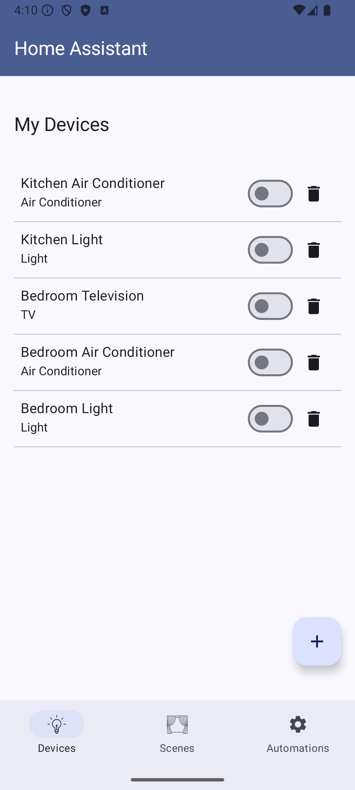
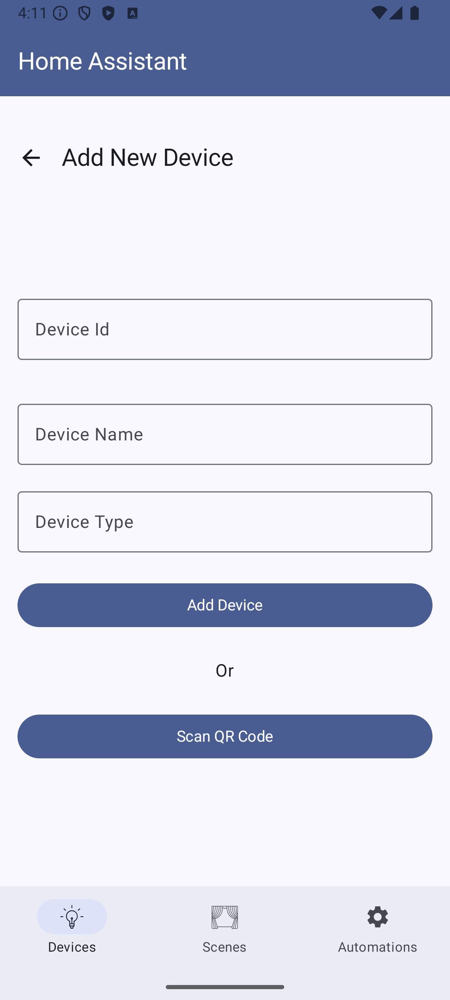
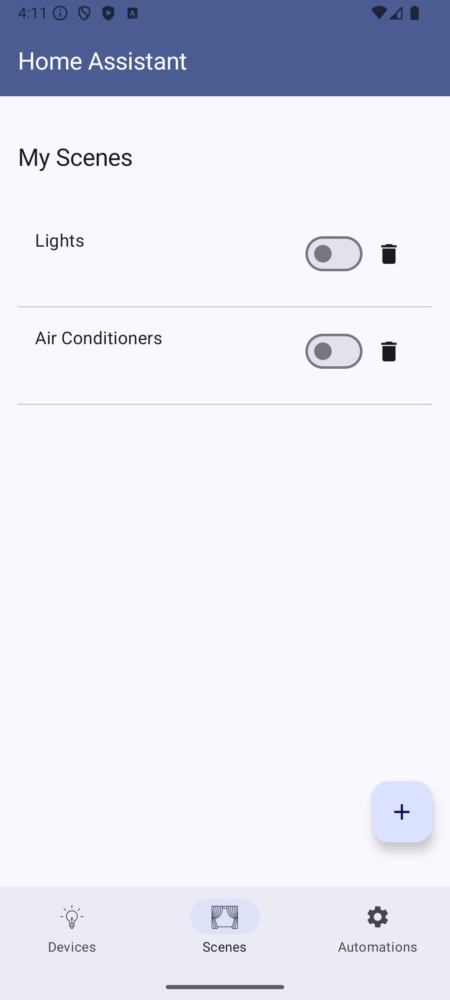
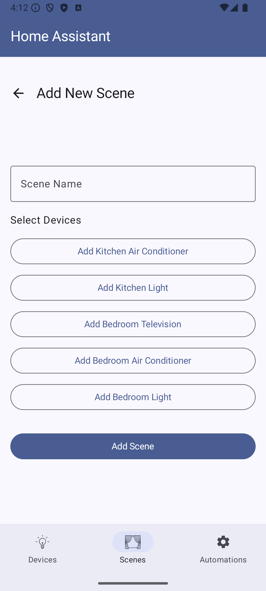
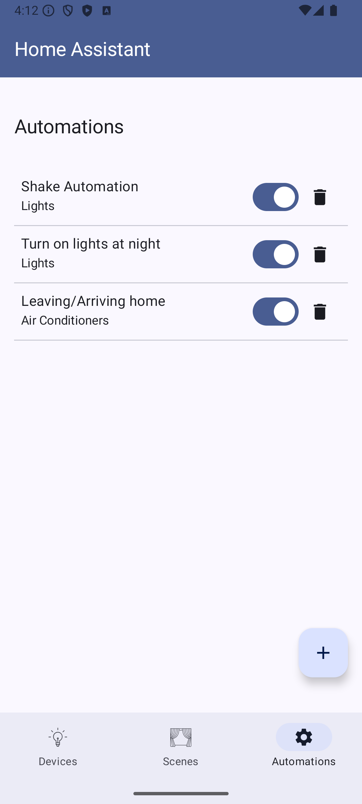
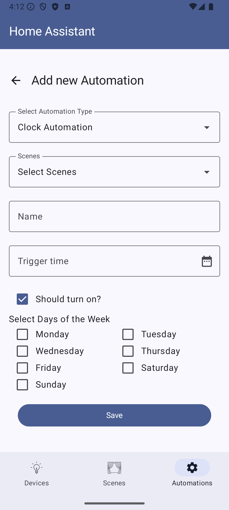
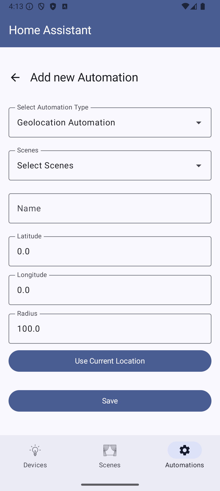
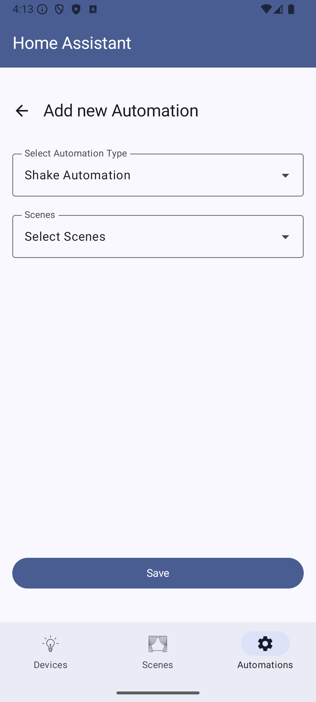

# HomeAssistant

Create a more organized and personalized smart home with HomeAssistant.

Set up and control your Lights, TVs, Air Conditioners, and more compatible devices, all from the HomeAssistant app.

## Screenshots

### Devices
 

### Scenes
 

### Automations
   