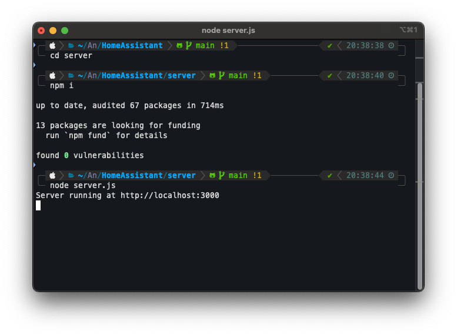
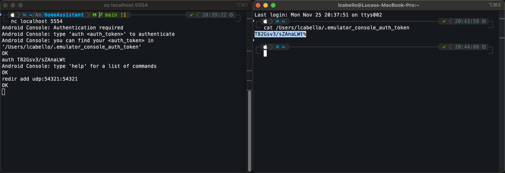

# HomeAssistant

Create a more organized and personalized smart home with HomeAssistant.

Set up and control your Lights, TVs, Air Conditioners, and more compatible devices, all from the HomeAssistant app.

## Screenshots

### Devices
 

### Scenes
 

### Automations
   

## How to run locally
1. Prerequisites
    - Install NodeJS

2. Run local server

```bash
cd server
```
```bash
npm i
```
```bash
node server.js
```



3. Configure port redirection in android emulator (Android emulator must be already open)

```bash
nc localhost 5554 ## mac
```
or
```bash
telnet localhost 5554 ## windows
```

```bash
auth {{credentials}} ## the console will tell you where your credentials are stored
```

```bash
redir add udp:54321:54321
```



More information about port redirection [here](https://developer.android.com/studio/run/emulator-networking#redirection).